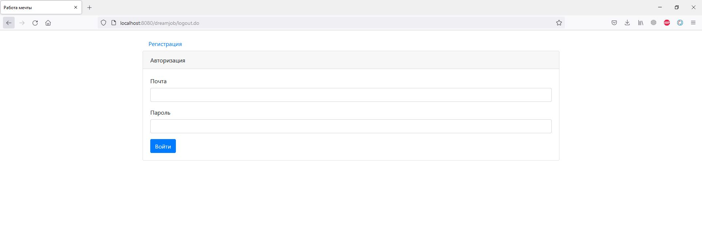

## Описание
CRUD приложение реализующее простую биржу труда.

В приложении реализованы:
* авторизация и регистрация пользователей;
* добавление вакансий и кандидатов;
* редактирование вакансий и кандидатов;
* добавление фото кандидата.

## Технологии
* Java 14
* PostgreSQL, JDBC
* JSP, JSTL
* HTML, BOOTSTRAP, JS, JQUERY, AJAX
* JUnit, Mockito
* Slf4j, Log4j

